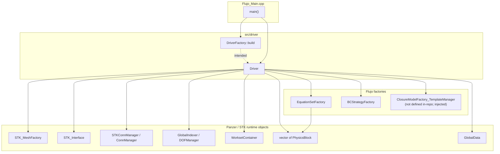
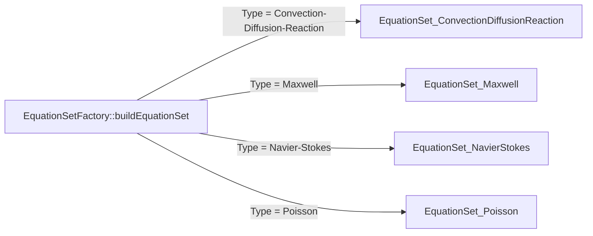

# Flujo source code documentation

This document describes the current **Flujo** codebase: entry point, driver layer, equation sets, boundary-condition strategies, utilities, and how they relate to **Panzer** / **Trilinos**. It reflects the repository as of the last review of all `.cpp` / `.hpp` sources.

---

## Project overview

**Flujo** is a parallel multiphysics finite-element driver aimed at unstructured meshes, built on **Trilinos** (notably **Panzer**, **STK**, **Phalanx**, **Kokkos**, **Teuchos**). The executable target in the root `CMakeLists.txt` links `Flujo_Main.cpp` and `src/driver/Flujo_Driver.cpp`; header-only modules under `src/eqn_sets/` and `src/closures/` are included where referenced.

The program flow is:

1. Initialize MPI and Kokkos; parse CLI (`-i` input file, optional timings output).
2. Load an XML or YAML parameter list and broadcast it.
3. Call `DriverFactory::build`, then `Driver::setup`, then `Driver::solve`.

Several integration points are **stubbed** at present (`DriverFactory::build`, `Driver::solve`, and equation-set evaluator registration); see [Implementation status](#implementation-status).

---

## Directory layout

| Path | Role |
|------|------|
| `Flujo_Main.cpp` | Executable entry: MPI, Kokkos, parameter parsing, driver lifecycle, timers. |
| `Flujo_WriteToExodus.hpp` | Template helper to push solution fields through a Panzer response library and write Exodus via STK. |
| `src/driver/` | `Driver` base class (mesh + physics + DOFs + worksets); `DriverFactory` (not implemented). |
| `src/eqn_sets/` | Panzer equation-set templates and `EquationSetFactory`. |
| `src/closures/` | BC strategy templates and `BCStrategyFactory`. |

---

## External stack (reference)

Flujo code depends on (non-exhaustive):

- **Teuchos**: `ParameterList`, `RCP`, communicators, timers, CLI parsing, XML/YAML parameter I/O.
- **Kokkos**: runtime initialization from `main`.
- **Panzer**: equation sets, physics blocks, global data, worksets, STK mesh helpers (`ModelEvaluatorFactory`, `STKConnManager`, `WorksetFactory`, DOF manager factories).
- **Phalanx**: `FieldManager` in equation-set and BC APIs.
- **Thyra**: vector types in `WriteToExodus`.

---

## Entry point: `Flujo_Main.cpp`

- Builds an MPI communicator (`Teuchos::MpiComm`), optionally restricts console output to rank 0 when `NProc > 1`.
- Parses `-i` for the input deck (must end with `.xml` or `.yaml`).
- Calls `Kokkos::initialize`.
- Reads parameters with `Teuchos::updateParametersFromXmlFileAndBroadcast` or the YAML equivalent.
- Constructs `Teuchos::RCP<Driver> driver = DriverFactory::build(input_params, comm)` (currently throws in `Flujo_DriverFactory.hpp`).
- Invokes `driver->setup(input_params)` and `driver->solve()`.
- On success or failure, summarizes `Teuchos::TimeMonitor` and optional YAML timing report; reports `Teuchos::StackedTimer` histograms.

---

## Driver layer

### `Driver` (`src/driver/Flujo_Driver.hpp`, `Flujo_Driver.cpp`)

Abstract orchestration class aligned with Panzer “mini-app” patterns: it owns factories for equation sets, closure models, and BC strategies, and Populates Panzer infrastructure from the input list.

**Constructor** takes:

- `Teuchos::RCP<const Teuchos::MpiComm<int>> comm`
- `Teuchos::RCP<const panzer::EquationSetFactory> eqset_factory`
- `Teuchos::RCP<const panzer::ClosureModelFactory_TemplateManager<panzer::Traits>> cm_factory`
- `Teuchos::RCP<const panzer::BCStrategyFactory> bc_factory`

**`setup`** reads these parameter sublists:

- `Mesh` — passed to `panzer_stk::ModelEvaluatorFactory::buildSTKMeshFactory` and mesh build/finalize.
- `Assembly` — `Workset Size`, `Default Integration Order`, `Build Transient Support`, `Field Order` (for blocked vs. standard DOF manager).
- `Block ID to Physics ID Mapping` — maps STK element blocks to physics IDs.
- `Physics Blocks` — cloned into a list consumed by `panzer::buildPhysicsBlocks`.

**Workflow inside `setup`:**

1. `panzer::createGlobalData()`.
2. Build STK mesh factory and uncommitted mesh from MPI communicator.
3. Build block ID → physics ID and block ID → `shards::CellTopology` from the mesh.
4. `panzer::buildPhysicsBlocks(...)` using `eqset_factory_`.
5. `finalizeMeshConstruction` via Panzer STK helpers.
6. `panzer_stk::STKConnManager` for connectivity.
7. `DOFManagerFactory` or `BlockedDOFManagerFactory` depending on `Field Order`.
8. `panzer_stk::WorksetFactory` + `panzer::WorksetContainer` with per-block workset needs and `global_indexer_`.

**`solve`** is currently a stub that always throws.

**Accessors** expose `comm_`, `mesh_`, `mesh_factory_`, `physics_blocks_`, `conn_manager_`, `global_indexer_`, `workset_container_`, `global_data_`.

### `DriverFactory` (`src/driver/Flujo_DriverFactory.hpp`)

Static `build(ParameterList, Comm)` is **not implemented**; it throws and returns null. This must be completed before `Flujo_Main.cpp` can run successfully end-to-end.

---

## Equation sets (`src/eqn_sets/`)

### `EquationSetFactory`

- Extends `panzer::EquationSetFactory`.
- `buildEquationSet` dispatches on the string parameter `"Type"`:

  | `"Type"` value | Template class |
  |----------------|------------------|
  | `Convection-Diffusion-Reaction` | `EquationSet_ConvectionDiffusionReaction` |
  | `Maxwell` | `EquationSet_Maxwell` |
  | `Navier-Stokes` | `EquationSet_NavierStokes` |
  | `Poisson` | `EquationSet_Poisson` |

- Uses Panzer macros `PANZER_DECLARE_EQSET_TEMPLATE_BUILDER` and `PANZER_BUILD_EQSET_OBJECTS`.

### Template equation sets

Each concrete set is a class template `template <typename EvalT> class EquationSet_* : public panzer::EquationSet_DefaultImpl<EvalT>` with implementation in a paired `*_impl.hpp` included from the header.

Common pattern:

- Constructor validates a small `ParameterList` (`Model ID`, `Basis Order`, `Integration Order`, plus equation-specific keys).
- Registers DOFs, gradients/curls and time derivatives as needed, `addClosureModel`, then `setupDOFs()`.
- `buildAndRegisterEquationSetEvaluators` is overridden but **not implemented** (throws) for all four types.

**Poisson** (`EquationSet_Poisson`): scalar potential `phi` with `HGrad` basis, gradient DOF.

**Convection–diffusion–reaction**: scalar `conc`, configurable `Basis Type` (default `HGrad`), gradient and time derivative.

**Maxwell**: `E_edge` (`HCurl`, curl and time derivative), `B_face` (`HDiv`, time derivative).

**Navier–Stokes**: `velocity` and `pressure` with configurable `Velocity Basis Type` / `Pressure Basis Type` (default `HGrad`), 2D/3D only; gradients and velocity time derivative.

---

## Boundary conditions (`src/closures/`)

### `BCStrategyFactory`

- Extends `panzer::BCStrategyFactory`.
- `buildBCStrategy` builds a `BCStrategy_TemplateManager` using `PANZER_BUILD_BCSTRATEGY_OBJECTS`.
- Registered strategy name: **`Constant`** → `BCStrategy_Dirichlet_Constant`.

### `BCStrategy_Dirichlet_Constant`

- Extends `panzer::BCStrategy_Dirichlet_DefaultImpl<EvalT>`.
- `setup`: ties BC to equation set name, resolves `PureBasis` from the side physics block for the DOF.
- `buildAndRegisterEvaluators`: for scalar bases uses `panzer::Constant<EvalT>` with parameter `"Value"`; for vector bases uses `panzer::ConstantVector<EvalT>` with `"Value X"` / `"Value Y"` / `"Value Z"` depending on dimension.

This is the only fully wired BC strategy in the tree.

---

## `Flujo_WriteToExodus.hpp`

Free function template:

```cpp
template <class Scalar>
void WriteToExodus(double time_stamp,
                   const Teuchos::RCP<const Thyra::VectorBase<Scalar>> &x,
                   const panzer::ModelEvaluator<Scalar> &model,
                   panzer::ResponseLibrary<panzer::Traits> &stkIOResponseLibrary,
                   panzer_stk::STK_Interface &mesh);
```

It fills model in-args with `x` and time, runs `stkIOResponseLibrary` residual evaluation, then `mesh.writeToExodus(time_stamp)`. Intended for I/O once a full solve path exists.

---

## Build system notes

- Root `CMakeLists.txt` builds executable `flujo` from `Flujo_Main.cpp` and `src/driver/Flujo_Driver.cpp`, C++20, links `Trilinos_LIBRARIES` and `Trilinos_TPL_LIBRARIES`, and adds include directories for `src/driver`, `src/closures`, `src/eqn_sets`.
- `src/CMakeLists.txt` references TriBITS-style targets (`TRIBITS_LIBRARY`); the root CMake path does not appear to use that file for the standalone executable.

---

## Implementation status

| Component | Status |
|-----------|--------|
| `Driver::setup` | Implemented |
| `Driver::solve` | Throws — not implemented |
| `DriverFactory::build` | Throws — not implemented |
| Equation set DOF registration | Implemented per physics |
| `buildAndRegisterEquationSetEvaluators` (all four sets) | Throws — not implemented |
| `BCStrategy_Dirichlet_Constant` | Implemented |
| `WriteToExodus` | Implemented (header-only helper) |

---

## Class diagrams (Mermaid)

### Inheritance and factory interfaces

Panzer base types are shown as compact aliases for readability (`panzer::EquationSetFactory`, etc.).

```mermaid
classDiagram
  direction TB

  class PanzerEquationSetFactory {
    <<abstract>>
  }
  class PanzerBCStrategyFactory {
    <<abstract>>
  }
  class PanzerEquationSetDefaultImpl {
    <<abstract>>
  }
  class PanzerBCStrategyDirichletDefaultImpl {
    <<abstract>>
  }

  class EquationSetFactory {
    +buildEquationSet()
  }
  class BCStrategyFactory {
    +buildBCStrategy()
  }

  class EquationSet_ConvectionDiffusionReaction~EvalT~ {
    +buildAndRegisterEquationSetEvaluators()
  }
  class EquationSet_Maxwell~EvalT~ {
    +buildAndRegisterEquationSetEvaluators()
  }
  class EquationSet_NavierStokes~EvalT~ {
    +buildAndRegisterEquationSetEvaluators()
  }
  class EquationSet_Poisson~EvalT~ {
    +buildAndRegisterEquationSetEvaluators()
  }

  class BCStrategy_Dirichlet_Constant~EvalT~ {
    +setup()
    +buildAndRegisterEvaluators()
  }

  PanzerEquationSetFactory <|-- EquationSetFactory
  PanzerBCStrategyFactory <|-- BCStrategyFactory

  PanzerEquationSetDefaultImpl <|-- EquationSet_ConvectionDiffusionReaction~EvalT~
  PanzerEquationSetDefaultImpl <|-- EquationSet_Maxwell~EvalT~
  PanzerEquationSetDefaultImpl <|-- EquationSet_NavierStokes~EvalT~
  PanzerEquationSetDefaultImpl <|-- EquationSet_Poisson~EvalT~

  PanzerBCStrategyDirichletDefaultImpl <|-- BCStrategy_Dirichlet_Constant~EvalT~
```



### Composition and runtime dependencies

Shows how the main binary and `Driver` relate to factories and major Panzer/STK objects (logical ownership after `setup`).



### Equation set factory dispatch



### BC factory dispatch


---

## Parameter list expectations (for `Driver::setup`)

The following top-level sublists are read directly in `Driver::setup`:

- **`Mesh`** — consumed by Panzer STK mesh factory (see Panzer documentation for `Source` and mesh-specific keys).
- **`Assembly`** — keys: `Workset Size` (default 2000), `Default Integration Order` (default -1), `Build Transient Support` (default false), `Field Order` (empty string triggers non-blocked DOF manager unless blocking is required).
- **`Block ID to Physics ID Mapping`** — drives `panzer::buildBlockIdToPhysicsIdMap`.
- **`Physics Blocks`** — per-block physics configuration; each block’s equation set `Type` must match one registered in `EquationSetFactory`.

---

## File index

| File | Contents |
|------|----------|
| `Flujo_Main.cpp` | Program entry, CLI, parameter I/O, driver calls |
| `Flujo_WriteToExodus.hpp` | Exodus write helper |
| `src/driver/Flujo_Driver.hpp` | `Driver` class declaration |
| `src/driver/Flujo_Driver.cpp` | `Driver::setup`, `Driver::solve` stub |
| `src/driver/Flujo_DriverFactory.hpp` | `DriverFactory` stub |
| `src/eqn_sets/Flujo_EquationSetFactory.hpp` | `EquationSetFactory` |
| `src/eqn_sets/Flujo_EquationSet_*.{hpp,_impl.hpp}` | Four equation set templates |
| `src/closures/Flujo_BCStrategy_Factory.hpp` | `BCStrategyFactory` |
| `src/closures/Flujo_BCStrategy_Dirichlet_Constant*.{hpp,_impl.hpp}` | Constant Dirichlet BC |

---

*Generated to describe the Flujo repository structure and class relationships; extend this file as implementations land.*
